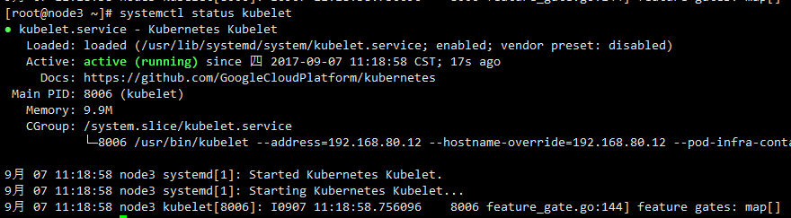
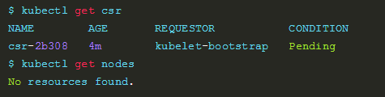
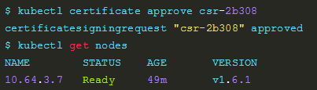
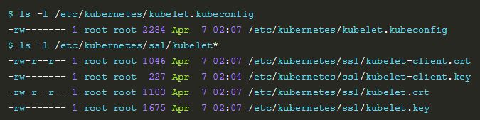

## 部署node节点
---
kubernetes node 节点包含如下组件：

- Flanneld
- Docker
- kubelet
- kube-proxy

下面着重讲kubelet和kube-proxy的安装。

### 安装和配置kubelet

#### 创建clusterrolebinding
kubelet 启动时向 kube-apiserver 发送 TLS bootstrapping 请求，需要先将 bootstrap token 文件中的 kubelet-bootstrap 用户赋予 system:node-bootstrapper cluster 角色(role)， 然后 kubelet 才能有权限创建认证请求：

```
cd /etc/kubernetes
kubectl create clusterrolebinding kubelet-bootstrap \
  --clusterrole=system:node-bootstrapper \
  --user=kubelet-bootstrap
```
#### 拷贝二进制文件

```
wget https://dl.k8s.io/v1.6.9/kubernetes-server-linux-amd64.tar.gz
tar -xzvf kubernetes-client-linux-amd64.tar.gz
cd kubernetes/server/bin
cp kube* /usr/bin/
```


#### 创建kubelet.service
/usr/lib/systemd/system/kubelet.service如下：
```
[Unit]
Description=Kubernetes Kubelet
Documentation=https://github.com/GoogleCloudPlatform/kubernetes
After=docker.service
Requires=docker.service

[Service]
WorkingDirectory=/var/lib/kubelet
EnvironmentFile=-/etc/kubernetes/config
EnvironmentFile=-/etc/kubernetes/kubelet
ExecStart=/usr/bin/kubelet \
            $KUBE_LOGTOSTDERR \
            $KUBE_LOG_LEVEL \
            $KUBELET_API_SERVER \
            $KUBELET_ADDRESS \
            $KUBELET_PORT \
            $KUBELET_HOSTNAME \
            $KUBE_ALLOW_PRIV \
            $KUBELET_POD_INFRA_CONTAINER \
            $KUBELET_ARGS
Restart=on-failure

[Install]
WantedBy=multi-user.target

```

- 注意：此时我们并没有WorkingDirectory，所有

        mkdir -p /var/lib/kubelet


#### 创建kubelet配置文件
/etc/kubernetes/kubelet 如下：

```
###
## kubernetes kubelet (minion) config
#
## The address for the info server to serve on (set to 0.0.0.0 or "" for all interfaces)
KUBELET_ADDRESS="--address=192.168.80.12"
#
## The port for the info server to serve on
#KUBELET_PORT="--port=10250"
#
## You may leave this blank to use the actual hostname
KUBELET_HOSTNAME="--hostname-override=192.168.80.12"
#
## location of the api-server
#KUBELET_API_SERVER="--api-servers=http://192.168.80.88:8080"
#
## pod infrastructure container
KUBELET_POD_INFRA_CONTAINER="--pod-infra-container-image=registry.access.redhat.com/rhel7/pod-infrastructure:latest"
#
## Add your own!
KUBELET_ARGS="--cgroup-driver=systemd --cluster-dns=10.254.0.2 --experimental-bootstrap-kubeconfig=/etc/kubernetes/bootstrap.kubeconfig --kubeconfig=/etc/kubernetes/kubelet.kubeconfig --require-kubeconfig=true --cert-dir=/etc/kubernetes/ssl --cluster-domain=cluster.local. --hairpin-mode promiscuous-bridge --serialize-image-pulls=false"

```


#### 启动kubelet

```
systemctl daemon-reload
systemctl enable kubelet
systemctl start kubelet
systemctl status kubelet
```


效果如下:




问题：kubelet cgroup driver: "systemd" is different from docker cgroup driver: "cgroupfs"

### 通过 kubelet 的 TLS 证书请求

kubelet 首次启动时向 kube-apiserver 发送证书签名请求，必须通过后 kubernetes 系统才会将该 Node 加入到集群。

#### 查看未授权的 CSR 请求

```
kubectl get csr
kubectl get nodes
```
效果如下：




#### 通过 CSR 请求


```
 kubectl certificate approve csr-2b308
 kubectl get nodes
```

效果如下:





此时自动生成了 kubelet kubeconfig 文件和公私钥

```
ls -l /etc/kubernetes/kubelet.kubeconfig
ls -l /etc/kubernetes/ssl/kubelet*
```





### 配置 kube-proxy

每台机器上都运行一个kube-proxy服务，它监听API server中service和endpoint的变化情况，并通过iptables等来为服务配置负载均衡（仅支持TCP和UDP）。

#### 创建 kube-proxy.service

/usr/lib/systemd/system/kube-proxy.service 如下：

```
[Unit]
Description=Kubernetes Kube-Proxy Server
Documentation=https://github.com/GoogleCloudPlatform/kubernetes
After=network.target

[Service]
EnvironmentFile=-/etc/kubernetes/config
EnvironmentFile=-/etc/kubernetes/proxy
ExecStart=/usr/bin/kube-proxy \
	    $KUBE_LOGTOSTDERR \
	    $KUBE_LOG_LEVEL \
	    $KUBE_MASTER \
	    $KUBE_PROXY_ARGS
Restart=on-failure
LimitNOFILE=65536

[Install]
WantedBy=multi-user.target
```


#### 创建proxy配置文件

/etc/kubernetes/proxy 如下：
```
###
# kubernetes proxy config

# default config should be adequate

# Add your own!
KUBE_PROXY_ARGS="--bind-address=192.168.80.12 --hostname-override=192.168.80.12 --kubeconfig=/etc/kubernetes/kube-proxy.kubeconfig --cluster-cidr=10.254.0.0/16"
```


#### 启动 kube-proxy

```
systemctl daemon-reload
systemctl enable kube-proxy
systemctl start kube-proxy
systemctl status kube-proxy
```
