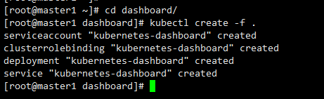

## 安装和部署dashboard

### yaml文件
官方的镜像需要翻墙才能下载，这里选用阿里云的镜像即可。

已经修改好的 yaml 文件见：[dashboard](kube-yaml/dashboard)

- 这里dashboard的版本1.6.3为中文版，1.6.0为英文版，根据需求选择。


### 修改的地方

这里暂时不做改动，这里涉及一个bug后续我们会提到的。


### 执行所有定义文件
```
cd dashboard
kubectl create -f .
```

效果如下：




### 检查执行结果
查看分配的 NodePort
```
kubectl get services kubernetes-dashboard -n kube-system
```


### 通过 kube-apiserver 访问dashboard

```
 kubectl cluster-info
```

得到dashboard的地址为：

    https://192.168.80.88:6443/api/v1/proxy/namespaces/kube-system/services/kubernetes-dashboard


- 这里呢就是因为没有证书，进行下一步即可。


### 导入证书


```
cd /etc/kubernetes/
openssl pkcs12 -export -in admin.pem  -out admin.p12 -inkey admin-key.pem
```

- 这里会提示让你输入密码，记住密码导入浏览器需要用到。


### 访问dashboard


访问地址：https://192.168.80.88:6443/api/v1/proxy/namespaces/kube-system/services/kubernetes-dashboard


效果如下:


