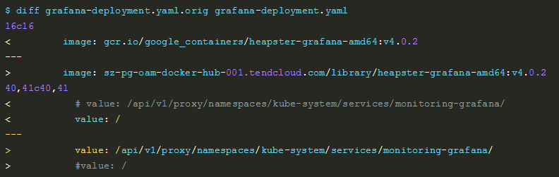
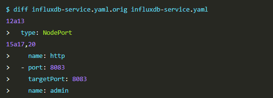
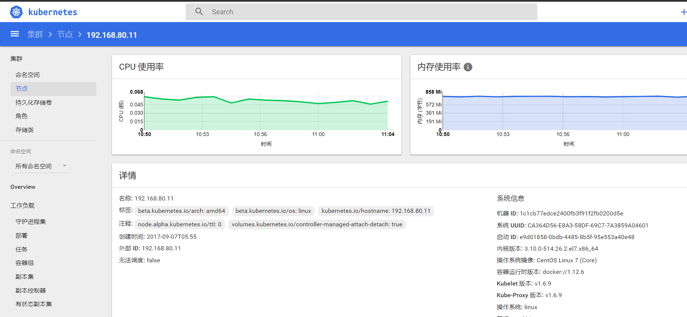
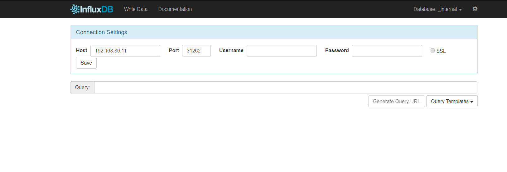
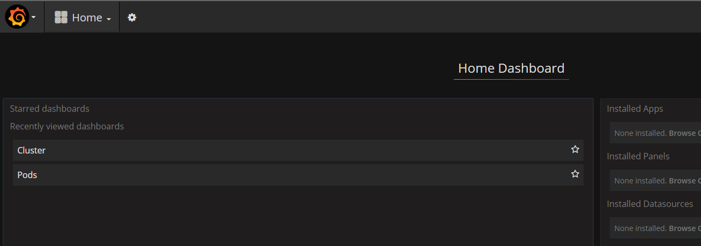

## 安装和配置Heapster

Heapster是容器集群监控和性能分析工具，天然的支持Kubernetes和CoreOS。


Kubernetes有个出名的监控agent—cAdvisor。在每个kubernetes Node上都会运行cAdvisor，它会收集本机以及容器的监控数据(cpu,memory,filesystem,network,uptime)。
在较新的版本中，K8S已经将cAdvisor功能集成到kubelet组件中。每个Node节点可以直接进行web访问。


> cAdvisor web界面访问： http://< Node-IP >:4194
cAdvisor也提供Restful API:https://github.com/google/cadvisor/blob/master/docs/api.md


Heapster首先从K8S Master获取集群中所有Node的信息，然后通过这些Node上的kubelet获取有用数据，而kubelet本身的数据则是从cAdvisor得到。所有获取到的数据都被推到Heapster配置的后端存储中，并还支持数据的可视化。现在后端存储 + 可视化的方法，如InfluxDB + grafana。


> 参考资料：[API文档](https://github.com/kubernetes/heapster/blob/master/docs/model.md)  ;      [Metrics](https://github.com/kubernetes/heapster/blob/master/docs/storage-schema.md)


### yaml文件


这里的yaml文件可以从[heapster release](https://github.com/kubernetes/heapster/releases)下载最新版本的 heapster。
也可以直接在之前下载的kubernetes包中进行下载，路径为：kubernetes/cluster/addons/cluster-monitoring/influxdb


这里需要自己额外创建一个heapster的rbac配置heapster-rbac.yaml文件。

已经修改好的 yaml 文件见：[heapster](kube-yaml/heapster)


### 需要修改的地方




- 如果后续使用 kube-apiserver 或者 kubectl proxy 访问 grafana dashboard，则必须将 GF_SERVER_ROOT_URL 设置为/api/v1/proxy/namespaces/kube-system/services/monitoring-grafana/，否则后续访问grafana时访问时提示找不到http://ip:8086/api/v1/proxy/namespaces/kube-system/services/monitoring-grafana/api/dashboards/home 页面


##### 配置 influxdb-deployment(重要)


influxdb 官方建议使用命令行或 HTTP API 接口来查询数据库，从 v1.1.0 版本开始默认关闭 admin UI，将在后续版本中移除 admin UI 插件。

开启镜像中 admin UI的办法如下：先导出镜像中的 influxdb 配置文件，开启 admin 插件后，再将配置文件内容写入 ConfigMap，最后挂载到镜像中，达到覆盖原始配置的目的：


#### 配置 monitoring-influxdb Service


- 定义端口类型为 NodePort，额外增加了 admin 端口映射，用于后续浏览器访问 influxdb 的 admin UI 界面


###  执行所有定义文件

```
cd heapster
kubectl create -f .

```


### 检查执行结果

检查 kubernets dashboard 界面，看是显示各 Nodes、Pods 的 CPU、内存、负载等利用率曲线图；
- 这里可能需要稍微等一下，存储数据绘制数据需要一定量的数据做支持。


效果如下：





---


访问 influxdb dashboard页面：
地址为：http://192.168.80.88:8080/api/v1/proxy/namespaces/kube-system/services/monitoring-influxdb:8083/

如下：



访问grafana dashboard ：
地址为：https://192.168.80.88:6443/api/v1/proxy/namespaces/kube-system/services/monitoring-grafana/

如下：




### 问题
这里存在一些小问题：

1. 使用haproxy做master高可用集群方案，现在的apiserver默认就是192.168.80.88

但是在访问dashboard的时候刚开始并没有访问成功，这时重启集群问题解决，原因不明。


2. dashboard中无法显示heapster的监控曲线，这里的情况下原因是因为dashboard找不到图像数据，而这种情况下官方给出的解释说这是一个bug，解决方案在[这里](https://github.com/kubernetes/dashboard/pull/2181/commits/4f8846f54c615a34a82ca8ec6cfd82cf87d03b3a)

根据解决方案，做了以下测试：

  - 重启创建dashboard，此时正常显示，但是集群重启后，或者说pod重启后，图像消失。这种方法在dashboard 1.6.2/1.6.3下效果相同。但是在1.6.0版本下dashoboard非常正常。
最后将版本定为1.6.0


3. 在教程中我们针对influxdb-dashboard做了端口映射，以便可以访问influxdb 的页面。但是最开始在haproxy中，我们只针对https做了代理转发，导致在这里我们只能使用node节点ip进行访问，却无法使用设置的虚拟ip即apiserver进行访问，为了解决这一问题，我们只需要对haproxy添加mode为http的端口监听即可。示例代码如下：

  ```
  listen k8s
bind 192.168.80.88:8080
balance leastconn
mode http
server master1 192.168.80.10:8080 check inter 2000 fall 3
server master2 192.168.80.11:8080 check inter 2000 fall 3
  ```


在这里我们将访问http://192.168.80.88:8080/.... 的请求全部转发到两个master节点，这样我们就省事多了。
