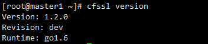
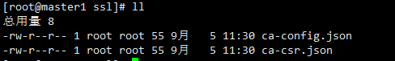
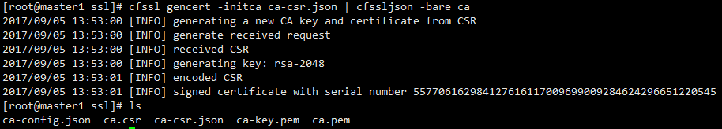
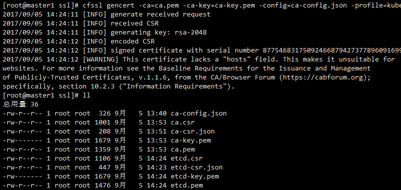
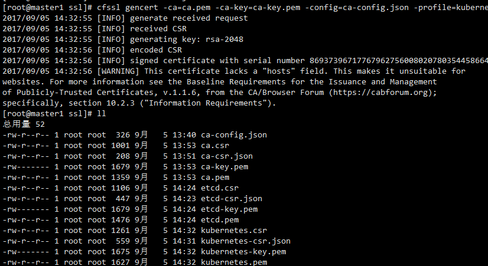
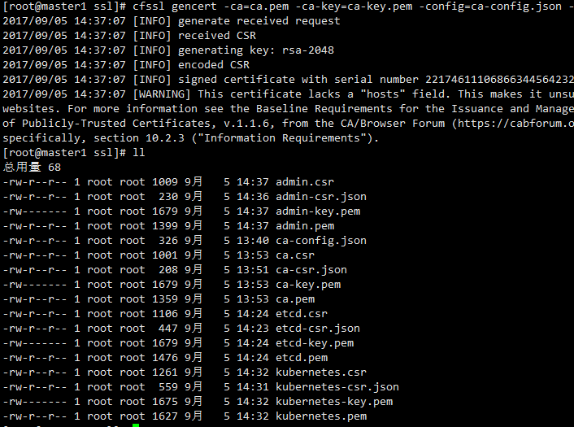

## 创建 CA 证书和秘钥
----

kubernetes系统各组件需要使用TLS证书对通信进行加密，本文档使用CloudFlar的PKI工具集
cfssl 来生成 Certificate Authority (CA) 证书和秘钥文件.

### 安装cfssl


~~~~~~~~~~~~~~~~~~~~~~~~~~~~~~~~~~~~~~~~~~~~~~~~~~~~~~~~~~~~~~~~~~~~~~~~~~~~~~~~
  wget https://pkg.cfssl.org/R1.2/cfssl_linux-amd64
  wget https://pkg.cfssl.org/R1.2/cfssljson_linux-amd64
  wget https://pkg.cfssl.org/R1.2/cfssl-certinfo_linux-amd64

  chmod +x cfssl_linux-amd64
  chmod +x cfssljson_linux-amd64
  chmod +x cfssl-certinfo_linux-amd64

  mv cfssl_linux-amd64 /usr/bin/cfssl
  mv cfssljson_linux-amd64 /usr/bin/cfssljson
  mv cfssl-certinfo_linux-amd64 /usr/bin/cfssl-certinfo
~~~~~~~~~~~~~~~~~~~~~~~~~~~~~~~~~~~~~~~~~~~~~~~~~~~~~~~~~~~~~~~~~~~~~~~~~~~~~~~~

#### 检验cfssl安装

~~~~~~~~~~~~~~~~~~~~~~~~~~~~~~~~~~~~~~~~~~~~~~~~~~~~~~~~~~~~~~~~~~~~~~~~~~~~~~~~
  cfssl version
~~~~~~~~~~~~~~~~~~~~~~~~~~~~~~~~~~~~~~~~~~~~~~~~~~~~~~~~~~~~~~~~~~~~~~~~~~~~~~~~

像下面这样就ok了：



## 创建CA(Certificate Authority)

### 创建 CA 配置文件

~~~~~~~~~~~~~~~~~~~~~~~~~~~~~~~~~~~~~~~~~~~~~~~~~~~~~~~~~~~~~~~~~~~~~~~~~~~~~~~~
    mkdir ssl  #创建CA目录
    cd ssl
    cfssl print-defaults config > ca-config.json
    cfssl print-defaults csr > ca-csr.json  #根据模板创建
~~~~~~~~~~~~~~~~~~~~~~~~~~~~~~~~~~~~~~~~~~~~~~~~~~~~~~~~~~~~~~~~~~~~~~~~~~~~~~~~

效果如下：



ca-config.json 如下:

```
{
  "signing": {
    "default": {
      "expiry": "8760h"
    },
    "profiles": {
      "kubernetes": {
        "usages": [
            "signing",
            "key encipherment",
            "server auth",
            "client auth"
        ],
        "expiry": "8760h"
      }
    }
  }
}
```

#### 创建 CA 证书签名请求

ca-csr.json如下：

~~~~~~~~~~~~~~~~~~~~~~~~~~~~~~~~~~~~~~~~~~~~~~~~~~~~~~~~~~~~~~~~~~~~~~~~~~~~~~~~
{
  "CN": "kubernetes",
  "key": {
    "algo": "rsa",
    "size": 2048
  },
  "names": [
    {
      "C": "CN",
      "ST": "BeiJing",
      "L": "BeiJing",
      "O": "k8s",
      "OU": "System"
    }
  ]
}
~~~~~~~~~~~~~~~~~~~~~~~~~~~~~~~~~~~~~~~~~~~~~~~~~~~~~~~~~~~~~~~~~~~~~~~~~~~~~~~~

#### 生成 CA 证书和私钥

```
cfssl gencert -initca ca-csr.json | cfssljson -bare ca
```

效果如下：




### 创建etcd证书

etcd集群使用TLS证书对证书通信进行加密，并开启基于CA根证书签名的双向数字证书认证。

下面介绍使用cfssl生成所需要的私钥和证书.


#### 创建etcd证书签名请求

etcd-csr.json如下：

```
{
    "CN": "kubernetes",
    "hosts": [
      "127.0.0.1",
      "192.168.80.10",
      "192.168.80.11",
      "192.168.80.12",
      "master1",
      "master2",
      "node3"
    ],
    "key": {
        "algo": "rsa",
        "size": 2048
    },
    "names": [
        {
            "C": "CN",
            "ST": "BeiJing",
            "L": "BeiJing",
            "O": "k8s",
            "OU": "System"
        }
    ]
}


```

* 注意上面配置hosts字段中制定授权使用该证书的IP和域名列表，因为现在要生成的证书需要被etcd集群各个节点使用，所以这里指定了各个节点的IP和hostname。

#### 生成etcd证书和私钥

```
cfssl gencert -ca=ca.pem -ca-key=ca-key.pem -config=ca-config.json -profile=kubernetes etcd-csr.json | cfssljson -bare etcd
```

效果如下:




### 创建 kubernetes 证书

#### 创建kubernetes证书签名请求

kubernetes-csr.json如下：

```
{
    "CN": "kubernetes",
    "hosts": [
      "127.0.0.1",
      "192.168.80.88",
      "192.168.80.10",
      "192.168.80.11",
      "192.168.80.12",
      "10.254.0.1",
      "kubernetes",
      "kubernetes.default",
      "kubernetes.default.svc",
      "kubernetes.default.svc.cluster",
      "kubernetes.default.svc.cluster.local"
    ],
    "key": {
        "algo": "rsa",
        "size": 2048
    },
    "names": [
        {
            "C": "CN",
            "ST": "BeiJing",
            "L": "BeiJing",
            "O": "k8s",
            "OU": "System"
        }
    ]
}
```


#### 生成 kubernetes 证书和私钥

```
cfssl gencert -ca=ca.pem -ca-key=ca-key.pem -config=ca-config.json -profile=kubernetes kubernetes-csr.json | cfssljson -bare kubernetes
```

效果如下:




### 创建 admin 证书

#### 创建 admin 证书签名请求

admin-csr.json如下：

```
{
  "CN": "admin",
  "hosts": [],
  "key": {
    "algo": "rsa",
    "size": 2048
  },
  "names": [
    {
      "C": "CN",
      "ST": "BeiJing",
      "L": "BeiJing",
      "O": "system:masters",
      "OU": "System"
    }
  ]
}

```


#### 生成 admin 证书和私钥

```
cfssl gencert -ca=ca.pem -ca-key=ca-key.pem -config=ca-config.json -profile=kubernetes admin-csr.json | cfssljson -bare admin
```

效果如下：




### 创建 kube-proxy 证书

#### 创建 kube-proxy 证书签名请求

kube-proxy-csr.json 如下：

```
{
  "CN": "system:kube-proxy",
  "hosts": [],
  "key": {
    "algo": "rsa",
    "size": 2048
  },
  "names": [
    {
      "C": "CN",
      "ST": "BeiJing",
      "L": "BeiJing",
      "O": "k8s",
      "OU": "System"
    }
  ]
}
```


#### 生成 kube-proxy 客户端证书和私钥

```
cfssl gencert -ca=ca.pem -ca-key=ca-key.pem -config=ca-config.json -profile=kubernetes  kube-proxy-csr.json | cfssljson -bare kube-proxy
```

效果如下：


### 分发证书

将生成的证书和秘钥文件（后缀名为.pem）拷贝到所有机器的 /etc/kubernetes/ssl 目录下备用.

```
mkdir -p /etc/kubernetes/ssl
cp *.pem /etc/kubernetes/ssl

```
