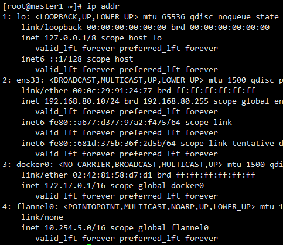

## Flannel安装和配置
----
### 安装Flannel

直接使用yum安装

```
yum install flannel
```

### 配置Flannel

修改配置文件 /etc/sysconfig/flanneld

具体如下：

```
# Flanneld configuration options

# etcd url location.  Point this to the server where etcd runs
FLANNEL_ETCD_ENDPOINTS="https://master1:2379,https://master2:2379,https://node3:2379"

# etcd config key.  This is the configuration key that flannel queries
# For address range assignment
FLANNEL_ETCD_PREFIX="/atomic.io/network"

# Any additional options that you want to pass
FLANNEL_OPTIONS="-etcd-cafile=/etc/kubernetes/ca.pem -etcd-certfile=/etc/kubernetes/kubernetes.pem -etcd-keyfile=/etc/kubernetes/kubernetes-key.pem"
```

- 每个节点都一样的配置


### 配置etcd中关于flannel的key


Flannel使用Etcd进行配置，来保证多个Flannel实例之间的配置一致性，所以需要在etcd上进行如下配置：（‘/atomic.io/network/config’这个key与上文/etc/sysconfig/flannel中的配置项FLANNEL_ETCD_PREFIX是相对应的，错误的话启动就会出错）

```
etcdctl  --ca-file=/etc/kubernetes/ca.pem --cert-file=/etc/kubernetes/etcd.pem --key-file=/etc/kubernetes/etcd-key.pem --endpoints=https://master1:2379,https://master2:2379,https://node3:2379 mk /atomic.io/network/config '{ "Network": "10.254.0.0/16" }'

```


效果如下：


### 重启一系列服务

```
systemctl enable flanneld.service
systemctl start flanneld.service
service docker restart
```


### 检验

```
ip addr
```

效果如下:




- 我们可以看到flannel0网卡，且ip地址属于10.254.0.0网段
