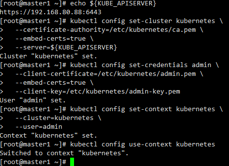

## 部署 kubectl 命令行工具


---

kubectl是Kubernetes的命令行工具（CLI），是Kubernetes用户和管理员必备的管理工具。
kubectl提供了大量的子命令，方便管理Kubernetes集群中的各种功能。
### 下载kubectl

首先下载kubernetes，提取二进制文件
```
wget https://dl.k8s.io/v1.6.9/kubernetes-server-linux-amd64.tar.gz
tar -xzvf kubernetes-client-linux-amd64.tar.gz
cd kubernetes/server/bin
cp kubectl /usr/bin/
```
### 创建 kubectl config 文件

#### 设置集群参数
```
kubectl config set-cluster kubernetes \
  --certificate-authority=/etc/kubernetes/ca.pem \
  --embed-certs=true \
  --server=${KUBE_APISERVER}
```
#### 设置客户端认证参数
```
kubectl config set-credentials admin \
  --client-certificate=/etc/kubernetes/admin.pem \
  --embed-certs=true \
  --client-key=/etc/kubernetes/admin-key.pem
```
#### 设置上下文参数
```
kubectl config set-context kubernetes \
  --cluster=kubernetes \
  --user=admin
```

#### 设置默认上下文

```
kubectl config use-context kubernetes
```

- 这里的${KUBE_APISERVER}设置为虚拟ip 即 mvip https://192.168.80.88:6443
  操作时可以在环境变量中进行设置，后续也比较好修改。（/etc/profile）


执行后效果如下：




> 以下属于个人理解：
> 最后呢生成的 kubeconfig 被保存到 ~/.kube/config 文件。这一部分的意义何在呢，主要来说config文件存储的信息有：
> >  cluster信息：Kubernetes server地址
用户信息：用户名、密码或密钥
Context：cluster、用户信息以及Namespace的组合

> kubectl命令行的作用在于可以通过获取其中的集群信息等提供一种命令行实现的“增删改查”所以说你希望在哪台机器上可以做这些操作，那么你就在相应机器上做以上操作进行配置。
