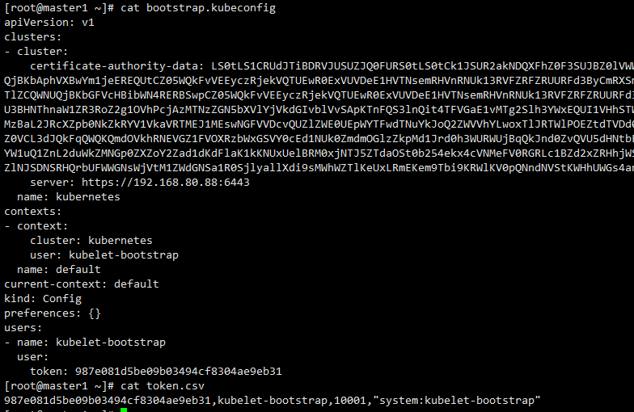

## 创建 kubeconfig 文件
---
kubelet、kube-proxy 等 Node 机器上的进程与 Master 机器的 kube-apiserver 进程通信时需要认证和授权；

kubernetes 1.4 开始支持由 kube-apiserver 为客户端生成 TLS 证书的 TLS Bootstrapping 功能，这样就不需要为每个客户端生成证书了；该功能当前仅支持为 kubelet 生成证书；

### 创建 TLS Bootstrapping Token


#### 生成token.csv
Token可以是任意的包涵128 bit的字符串，可以使用安全的随机数发生器生成。
```
export BOOTSTRAP_TOKEN=$(head -c 16 /dev/urandom | od -An -t x | tr -d ' ')
cat > token.csv <<EOF
${BOOTSTRAP_TOKEN},kubelet-bootstrap,10001,"system:kubelet-bootstrap"
EOF
```
- 复制粘贴执行就好
- 对于Token的作用，就是Master节点的apiserver和Node节点的kubelet通信时，会持有Token，所以Token就是暗号，对上了才可以通信。

#### 分发token.csv

```
cp token.csv /etc/kubernetes/
```
- 注意：token.csv一定要分发到每个master，都用同一个token.csv就好。


### 创建 kubelet bootstrapping kubeconfig 文件

>套路都是一样的

#### 设置集群参数
```
kubectl config set-cluster kubernetes \
--certificate-authority=/etc/kubernetes/ca.pem \
--embed-certs=true \
--server=${KUBE_APISERVER} \
--kubeconfig=bootstrap.kubeconfig
```


#### 设置客户端认证参数

````
kubectl config set-credentials kubelet-bootstrap \
  --token=${BOOTSTRAP_TOKEN} \
  --kubeconfig=bootstrap.kubeconfig
````

#### 设置上下文参数

```
kubectl config set-context default \
  --cluster=kubernetes \
  --user=kubelet-bootstrap \
  --kubeconfig=bootstrap.kubeconfig
```

#### 设置默认上下文

```
kubectl config use-context default --kubeconfig=bootstrap.kubeconfig
```


### 创建 kube-proxy kubeconfig 文件

#### 设置集群参数
```
kubectl config set-cluster kubernetes \
  --certificate-authority=/etc/kubernetes/ca.pem \
  --embed-certs=true \
  --server=${KUBE_APISERVER} \
  --kubeconfig=kube-proxy.kubeconfig
```
#### 设置客户端认证参数
```
kubectl config set-credentials kube-proxy \
  --client-certificate=/etc/kubernetes/kube-proxy.pem \
  --client-key=/etc/kubernetes/kube-proxy-key.pem \
  --embed-certs=true \
  --kubeconfig=kube-proxy.kubeconfig
```
#### 设置上下文参数
```
kubectl config set-context default \
  --cluster=kubernetes \
  --user=kube-proxy \
  --kubeconfig=kube-proxy.kubeconfig
```
#### 设置默认上下文
```
kubectl config use-context default --kubeconfig=kube-proxy.kubeconfig

```


### 分发 kubeconfig 文件

将两个 kubeconfig 文件分发到所有 Node 机器的 /etc/kubernetes/ 目录

    cp bootstrap.kubeconfig kube-proxy.kubeconfig /etc/kubernetes/


- 我们可以查看下bootstrap.kubeconfi文件的内容，里面能够看到token的值。如下：


