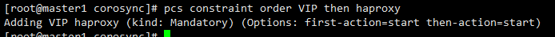

## 部署pacemaker+haproxy集群
---
此处部署主要用于Master集群，通过haproxy实现一个虚拟ip，即VIP。apiserver访问这个虚拟ip。

集群中每个master节点都安装apiserver、scheduler以及controller-manager。整个kubernetes的apiserver地址为虚拟ip：6443


### 部署pcs集群

#### 安装pacemaker

```
yum install -y pacemaker pcs psmisc policycoreutils-python corosync fence-agents-all
```

#### 然后启动pcs并设置开机自启

```
systemctl start pcsd.service
systemctl enable pcsd.service
```


####  配置hacluster密码

- 每台master都需要设置

```
echo '828' | passwd --stdin hacluster
```

#### 验证集群认证
```
cd /etc/corosync/
corosync-keygen
```


效果如下：


```
pcs cluster auth master1 master2 -u hacluster -p 828 --force
```

效果如下:


#### 创建kube-master集群


```
pcs cluster setup --name kube-master master1 master2
```


效果如下：


#### 启动集群

```
pcs cluster start --all
pcs cluster enable --all
```


效果如下:


#### 检查配置是否正确

```
crm_verify -L -V
```

- 一般情况会出现错误，如下:


#### 修改配置

```
pcs property set stonith-enabled=false      #禁用stonith；
pcs property set no-quorum-policy=ignore    #无法仲裁时，选择忽略；
```

- 完成修改配置后，再次执行crm_verify -L -V，什么也没有出来，当然没有消息就是最好的消息。


> 相关常用参数总结
> pcs cluster enable --all                    #设置集群开机自动；
>corosync-cfgtool -s                         #检查各节点通信状态(显示为no faults即为OK)；
>pcs status corosync                         #查看coyosync状态；
>pcs status                                  #查看pacemaker集群状态；


#### 配置VIP


```
pcs resource create VIP ocf:heartbeat:IPaddr2 ip=192.168.80.88 cidr_netmask=24 nic=ens33 op monitor interval=15s
```

- 192.168.80.88 为设置的虚拟ip
  ens33为网卡名称


### 配置haproxy实现与pacemaker结合


#### 安装haproxy

```
yum install haproxy
```


#### 配置haproxy

备份配置文件

```
mv /etc/haproxy/haproxy.cfg /etc/haproxy/haproxy.cfg.bak01
```

修改配置文件

```
cat > /etc/haproxy/haproxy.cfg << EOF
global
log 127.0.0.1 local1
log 127.0.0.1 local0 info
chroot /var/lib/haproxy
pidfile /var/run/haproxy.pid
maxconn 4000
user haproxy
group haproxy
daemon

stats socket /var/lib/haproxy/stats

defaults
log global
mode tcp
option httplog
option dontlognull
option http-server-close
option forwardfor except 127.0.0.0/8
option redispatch
retries 3
timeout http-request 10s
timeout queue 1m
timeout connect 10s
timeout client 1m
timeout server 1m
timeout http-keep-alive 10s
timeout check 10s
maxconn 3000

frontend stats-front
bind *:8088
mode http
default_backend stats-back

backend stats-back
mode http
balance source
stats uri /stats
stats auth admin:828

listen Kubernetes-Cluster
bind 192.168.80.88:6443
balance leastconn
mode tcp
server master1 192.168.80.10:6443 check inter 2000 fall 3
server master2 192.168.80.11:6443 check inter 2000 fall 3

EOF
```


#### 启动服务

```
systemctl start haproxy
systemctl status haproxy
```


效果如下：


#### 将Haproxy加入到PCS集群

```
systemctl disable haproxy
pcs resource create haproxy systemd:haproxy op monitor interval="5s"
pcs constraint colocation add VIP haproxy INFINITY  
pcs constraint order VIP then haproxy
```


最后是这样的：




这个时候查看下集群状态：


#### 验证

说明以下验证方法：

1. 将当前haproxy所在节点关机，看VIP以及haproxy是否转移
2. ip addr 查看ip是否有变化
