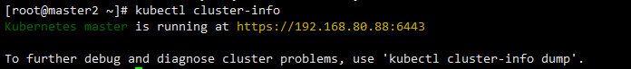

## 部署Master节点

---

kubernetes master 节点包含的组件：

- kube-apiserver
- kube-scheduler
- kube-controller-manager

我们需要在两个master节点都进行以下操作。

### 下载二进制文件
```
cd kubernetes/server/bin
cp kube* /usr/bin
```
### 配置和启动 kube-apiserver

#### 创建 kube-apiserver的service

/usr/lib/systemd/system/kube-apiserver.service 如下：

```
[Unit]
Description=Kubernetes API Service
Documentation=https://github.com/GoogleCloudPlatform/kubernetes
After=network.target
After=etcd.service

[Service]
EnvironmentFile=-/etc/kubernetes/config
EnvironmentFile=-/etc/kubernetes/apiserver
ExecStart=/usr/bin/kube-apiserver \
	    $KUBE_LOGTOSTDERR \
	    $KUBE_LOG_LEVEL \
	    $KUBE_ETCD_SERVERS \
	    $KUBE_API_ADDRESS \
	    $KUBE_API_PORT \
	    $KUBELET_PORT \
	    $KUBE_ALLOW_PRIV \
	    $KUBE_SERVICE_ADDRESSES \
	    $KUBE_ADMISSION_CONTROL \
	    $KUBE_API_ARGS
Restart=on-failure
Type=notify
LimitNOFILE=65536

[Install]
WantedBy=multi-user.target
```

#### config配置
/etc/kubernetes/config 如下:

```
###
# kubernetes system config
#
# The following values are used to configure various aspects of all
# kubernetes services, including
#
#   kube-apiserver.service
#   kube-controller-manager.service
#   kube-scheduler.service
#   kubelet.service
#   kube-proxy.service
# logging to stderr means we get it in the systemd journal
KUBE_LOGTOSTDERR="--logtostderr=true"

# journal message level, 0 is debug
KUBE_LOG_LEVEL="--v=0"

# Should this cluster be allowed to run privileged docker containers
KUBE_ALLOW_PRIV="--allow-privileged=true"

# How the controller-manager, scheduler, and proxy find the apiserver
#KUBE_MASTER="--master=http://sz-pg-oam-docker-test-001.tendcloud.com:8080"
KUBE_MASTER="--master=http://master1:8080"
```

-该配置文件同时被kube-apiserver、kube-controller-manager、kube-scheduler、kubelet、kube-proxy使用。


#### apiserver配置文件

/etc/kubernetes/apiserver 如下：

```
###
## kubernetes system config
##
## The following values are used to configure the kube-apiserver
##
#
## The address on the local server to listen to.
#KUBE_API_ADDRESS="--insecure-bind-address=sz-pg-oam-docker-test-001.tendcloud.com"
KUBE_API_ADDRESS="--advertise-address=192.168.80.10 --bind-address=192.168.80.10 --insecure-bind-address=192.168.80.10"
#
## The port on the local server to listen on.
#KUBE_API_PORT="--port=8080"
#
## Port minions listen on
#KUBELET_PORT="--kubelet-port=10250"
#
## Comma separated list of nodes in the etcd cluster
KUBE_ETCD_SERVERS="--etcd-servers=https://master1:2379,https://master2:2379,https://node3:2379"
#
## Address range to use for services
KUBE_SERVICE_ADDRESSES="--service-cluster-ip-range=10.254.0.0/16"
#
## default admission control policies
KUBE_ADMISSION_CONTROL="--admission-control=ServiceAccount,NamespaceLifecycle,NamespaceExists,LimitRanger,ResourceQuota"
#
## Add your own!
KUBE_API_ARGS="--authorization-mode=RBAC --runtime-config=rbac.authorization.k8s.io/v1beta1 --kubelet-https=true --experimental-bootstrap-token-auth --token-auth-file=/etc/kubernetes/token.csv --service-node-port-range=30000-32767 --tls-cert-file=/etc/kubernetes/kubernetes.pem --tls-private-key-file=/etc/kubernetes/kubernetes-key.pem --client-ca-file=/etc/kubernetes/ca.pem --service-account-key-file=/etc/kubernetes/ca-key.pem --etcd-cafile=/etc/kubernetes/ca.pem --etcd-certfile=/etc/kubernetes/kubernetes.pem --etcd-keyfile=/etc/kubernetes/kubernetes-key.pem --enable-swagger-ui=true --apiserver-count=3 --audit-log-maxage=30 --audit-log-maxbackup=3 --audit-log-maxsize=100 --audit-log-path=/var/lib/audit.log --event-ttl=1h"
```

#### 	启动apiserver

```
systemctl daemon-reload
systemctl enable kube-apiserver
systemctl start kube-apiserver
systemctl status kube-apiserver
```


效果如下：


### 配置和启动 kube-controller-manager

#### 创建 kube-controller-manager的serivce

/usr/lib/systemd/system/kube-controller-manager.service如下:

```
Description=Kubernetes Controller Manager
Documentation=https://github.com/GoogleCloudPlatform/kubernetes

[Service]
EnvironmentFile=-/etc/kubernetes/config
EnvironmentFile=-/etc/kubernetes/controller-manager
ExecStart=/usr/bin/kube-controller-manager \
	    $KUBE_LOGTOSTDERR \
	    $KUBE_LOG_LEVEL \
	    $KUBE_MASTER \
	    $KUBE_CONTROLLER_MANAGER_ARGS
Restart=on-failure
LimitNOFILE=65536

[Install]
WantedBy=multi-user.target

```


#### 创建配置文件
/etc/kubernetes/controller-manager 如下：

```
###
# The following values are used to configure the kubernetes controller-manager

# defaults from config and apiserver should be adequate

# Add your own!
KUBE_CONTROLLER_MANAGER_ARGS="--address=127.0.0.1  --master=http://master1:8080 --service-cluster-ip-range=10.254.0.0/16 --cluster-name=kubernetes --cluster-signing-cert-file=/etc/kubernetes/ca.pem --cluster-signing-key-file=/etc/kubernetes/ca-key.pem  --service-account-private-key-file=/etc/kubernetes/ca-key.pem --root-ca-file=/etc/kubernetes/ca.pem --leader-elect=true"
```

#### 启动kube-controller-manager

```
systemctl daemon-reload
systemctl enable kube-controller-manager
systemctl start kube-controller-manager
systemctl status kube-controller-manager
```

效果如下：


- 这里有个警告 注意


### 配置和启动 kube-scheduler

#### 创建 kube-scheduler的serivce配置文件

/usr/lib/systemd/system/kube-scheduler.service如下：

```
[Unit]
Description=Kubernetes Scheduler Plugin
Documentation=https://github.com/GoogleCloudPlatform/kubernetes

[Service]
EnvironmentFile=-/etc/kubernetes/config
EnvironmentFile=-/etc/kubernetes/scheduler
ExecStart=/usr/bin/kube-scheduler \
            $KUBE_LOGTOSTDERR \
            $KUBE_LOG_LEVEL \
            $KUBE_MASTER \
            $KUBE_SCHEDULER_ARGS
Restart=on-failure
LimitNOFILE=65536

[Install]
WantedBy=multi-user.target
```

#### 创建scheduler配置文件

/etc/kubernetes/scheduler 如下：

```
###
# kubernetes scheduler config

# default config should be adequate

# Add your own!
KUBE_SCHEDULER_ARGS="--leader-elect=true --address=127.0.0.1"
```

#### 启动 kube-scheduler

```
systemctl daemon-reload
systemctl enable kube-scheduler
systemctl start kube-scheduler
systemctl status kube-scheduler
```


效果如下：


### Master集群验证

master集群任意节点都可以
前提是配置kubectl config文件
```
kubectl get cs
```


正确示意如下:



