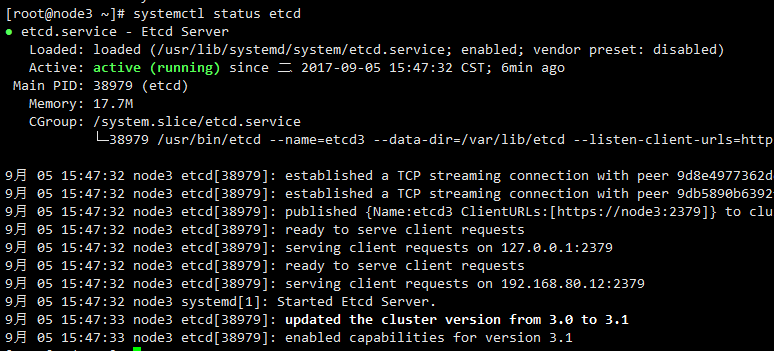
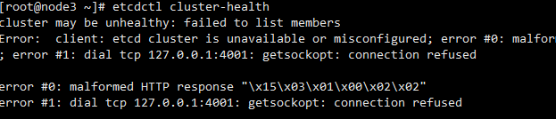
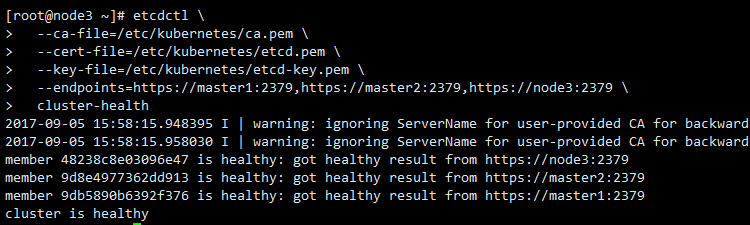

## 高可用etcd集群部署

---

这里部署的etcd集群使用TLS证书对证书通信进行加密，并开启基于CA根证书签名的双向数字证书认证。

## 创建etcd证书
参考 [创建CA证书和私钥](创建CA证书和秘钥.md)

## etcd安装

```
yum install etcd
```

## etcd配置

### 创建etcd的数据目录：

```
mkdir -p /var/lib/etcd
```

- 每个节点

### 配置etcd配置文件

/etc/etcd/etcd.conf 如下：

```
# [member]
ETCD_NAME=etcd3
ETCD_DATA_DIR="/var/lib/etcd"
#ETCD_WAL_DIR=""
#ETCD_SNAPSHOT_COUNT="10000"
#ETCD_HEARTBEAT_INTERVAL="100"
#ETCD_ELECTION_TIMEOUT="1000"
ETCD_LISTEN_PEER_URLS="https://node3:2380"
ETCD_LISTEN_CLIENT_URLS="https://node3:2379,https://127.0.0.1:2379"
#ETCD_MAX_SNAPSHOTS="5"
#ETCD_MAX_WALS="5"
#ETCD_CORS=""
#
#[cluster]
ETCD_INITIAL_ADVERTISE_PEER_URLS="https://node3:2380"
# if you use different ETCD_NAME (e.g. test), set ETCD_INITIAL_CLUSTER value for this name, i.e. "test=http://..."
ETCD_INITIAL_CLUSTER="etcd1=https://master1:2380,etcd2=https://master2:2380,etcd3=https://node3:2380"
ETCD_INITIAL_CLUSTER_STATE="new"
ETCD_INITIAL_CLUSTER_TOKEN="etcd-cluster"
ETCD_ADVERTISE_CLIENT_URLS="https://node3:2379"
#ETCD_DISCOVERY=""
#ETCD_DISCOVERY_SRV=""
#ETCD_DISCOVERY_FALLBACK="proxy"
#ETCD_DISCOVERY_PROXY=""
#ETCD_STRICT_RECONFIG_CHECK="false"
#ETCD_AUTO_COMPACTION_RETENTION="0"
#
#[proxy]
#ETCD_PROXY="off"
#ETCD_PROXY_FAILURE_WAIT="5000"
#ETCD_PROXY_REFRESH_INTERVAL="30000"
#ETCD_PROXY_DIAL_TIMEOUT="1000"
#ETCD_PROXY_WRITE_TIMEOUT="5000"
#ETCD_PROXY_READ_TIMEOUT="0"
#
#[security]
ETCD_CERT_FILE="/etc/kubernetes/etcd.pem"
ETCD_KEY_FILE="/etc/kubernetes/etcd-key.pem"
#ETCD_CLIENT_CERT_AUTH="false"
ETCD_TRUSTED_CA_FILE="/etc/kubernetes/ca.pem"
#ETCD_AUTO_TLS="false"
ETCD_PEER_CERT_FILE="/etc/kubernetes/etcd.pem"
ETCD_PEER_KEY_FILE="/etc/kubernetes/etcd-key.pem"
#ETCD_PEER_CLIENT_CERT_AUTH="false"
ETCD_PEER_TRUSTED_CA_FILE="/etc/kubernetes/ca.pem"
#ETCD_PEER_AUTO_TLS="false"
#
#[logging]
#ETCD_DEBUG="false"
# examples for -log-package-levels etcdserver=WARNING,security=DEBUG
#ETCD_LOG_PACKAGE_LEVELS=""
#
#[profiling]
#ETCD_ENABLE_PPROF="false"
#ETCD_METRICS="basic"

```

- 每个节点进行配置，只需要将ip地址替换即可。


### etcd启动

```
systemctl daemon-reload
systemctl enable etcd
systemctl start etcd
systemctl status etcd
```

正常启动效果如下：




### 检验是否高可用

- 任一节点都可以检验

#### 不使用证书

```
etcdctl cluster-health
```

效果如下：



- 注意：报错是正常的，如果未报错则说明集群未开启证书通信。

#### 使用证书

```
etcdctl \
  --ca-file=/etc/kubernetes/ca.pem \
  --cert-file=/etc/kubernetes/etcd.pem \
  --key-file=/etc/kubernetes/etcd-key.pem \
  --endpoints=https://master1:2379,https://master2:2379,https://node3:2379 \
  cluster-health
```

效果如下：




### 注意事项及问题

#### 注意事项


- etcd的配置有两个地方：
  - 一个是/etc/etcd/etcd.conf文件，这个文件中列出了所有的配置，去掉注释添加配置即可。
  - 另一个是service配置，即/usr/lib/systemd/system/etcd.service文件，即相当于命令行启动，只不过命令行一次配置，无需多次输入。
  - 其实两种配置的参数之类的都是一致的，对于两种方式选择一种就好，也可以直接用命令行启动。


#### 问题

- etcd集群如果采用/etc/etcd/etcd.conf的配置，启动时会出现错误提示说/bin/bash不存在。原因是找不到二进制文件，我们可以强行在serice指定为/usr/bin/etcd
