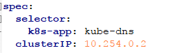
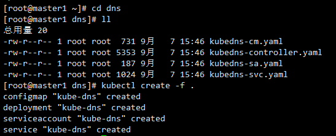
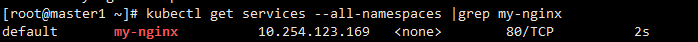
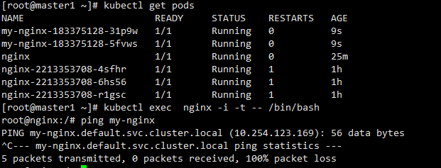

## 安装和配置 kubedns 插件

官方的yaml文件目录：kubernetes/cluster/addons/dns

- 这一部分怎么获取呢，方法如下：
```
wget https://github.com/kubernetes/kubernetes/releases/download/v1.6.9/kubernetes.tar.gz
tar -xzvf kubernetes.tar.gz
cd kubernetes/cluster/addons
```
在这个文件夹里包含官方提供的配置文件


###  yaml 文件

官方的镜像需要翻墙才能下载，这里选用阿里云的镜像即可。

已经修改好的 yaml 文件见：[dns]()

### 系统预定义的 RoleBinding

预定义的 RoleBinding system:kube-dns 将 kube-system 命名空间的 kube-dns ServiceAccount 与 system:kube-dns Role 绑定， 该 Role 具有访问 kube-apiserver DNS 相关 API 的权限；


kubedns-controller.yaml 中定义的 Pods 时使用了 kubedns-sa.yaml 文件定义的 kube-dns ServiceAccount，所以具有访问 kube-apiserver DNS 相关 API 的权限。


### 需要修改的地方

kubedns-svc.yaml中有一行：


这个地方的clusterIP需要和 kubelet 的 --cluster-dns 参数值一致；


### 执行所有定义文件
```
cd dns
kubectl create -f .
```

效果如下：


- 如果想撤销创建不需要一个一个删除，执行
```
kubectl delete -f .
```

查看创建进度

```
kubectl get pods -n kube-system
```


### 验证dns功能

#### 新建一个 my-nginx.yaml


 my-nginx.yaml 如下：

 ```
 apiVersion: extensions/v1beta1
kind: Deployment
metadata:
  name: my-nginx
spec:
  replicas: 2
  template:
    metadata:
      labels:
        run: my-nginx
    spec:
      containers:
      - name: my-nginx
        image: daocloud.io/library/nginx:latest
        ports:
        - containerPort: 80
 ```


 ```
 kubectl create -f my-nginx.yaml
 ```


Export 该 Deployment, 生成 my-nginx 服务


````
kubectl expose deploy my-nginx
kubectl get services --all-namespaces |grep my-nginx
````




创建另一个 Pod，查看 /etc/resolv.conf 是否包含 kubelet 配置的 --cluster-dns 和 --cluster-domain，是否能够将服务my-nginx 解析到 Cluster IP 10.254.123.169。


```
kubectl exec  nginx -i -t -- /bin/bash
```





明显可以解析到，那么说明安装没问题。
