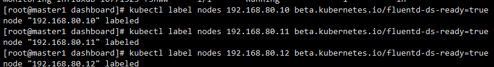
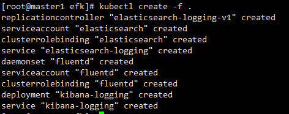
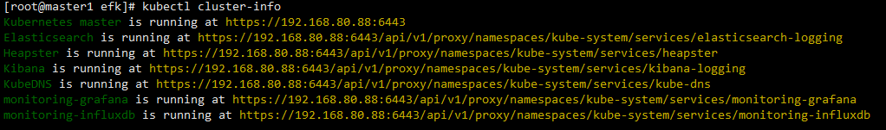
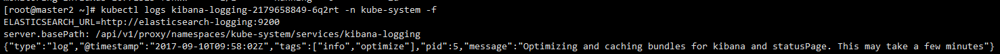
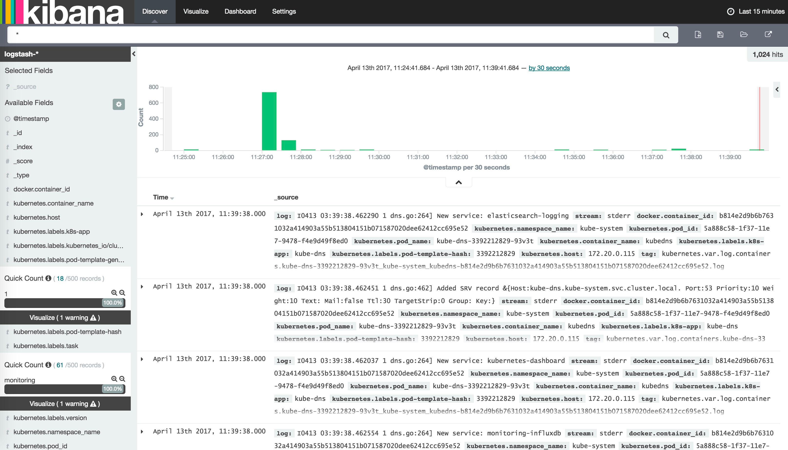

## 安装和配置EFK

### 组件简介

- Fluentd是一个开源收集事件和日志系统，它目前提供150+扩展插件让你存储大数据用于日志搜索，数据分析和存储。

  - [官方地址](http://fluentd.org/)  
  - [插件地址](http://fluentd.org/plugin/)

- Kibana 是一个为 ElasticSearch 提供日志分析的 Web ui工具，可使用它对日志进行高效的搜索、可视化、分析等各种操作。
  - [官方地址](http://www.elasticsearch.org/overview/kibana/)


- elasticsearch 是开源的（Apache2协议），分布式的，RESTful的，构建在Apache Lucene之上的的搜索引擎.

  - [官方地址](http://www.elasticsearch.org/overview/)    
  - [中文地址](http://es-cn.medcl.net/)


具体的工作流程就是利用fluentd 监控集群的系统日志，将过滤后的日志内容发给全文搜索服务ElasticSearch, 然后用ElasticSearch结合Kibana 进行自定义搜索web页面展示.


### yaml文件

> 官方文件目录：cluster/addons/fluentd-elasticsearch


EFK服务也需要一个efk-rbac.yaml文件，配置serviceaccount为efk。

已经修改好的 yaml 文件见：[efk]()


### 给 Node 设置标签

定义 DaemonSet fluentd-es-v1.22 时设置了 nodeSelector beta.kubernetes.io/fluentd-ds-ready=true ，所以需要在期望运行 fluentd 的 Node 上设置该标签；

```
kubectl label nodes 192.168.80.10 beta.kubernetes.io/fluentd-ds-ready=true

kubectl label nodes 192.168.80.11 beta.kubernetes.io/fluentd-ds-ready=true


kubectl label nodes 192.168.80.12 beta.kubernetes.io/fluentd-ds-ready=true
```


如下:




### 执行定义文件




### 访问 kibana

通过 kube-apiserver 访问：获取 Kibana 服务 URL




浏览器访问 URL： https://192.168.80.88:6443/api/v1/proxy/namespaces/kube-system/services/kibana-logging/app/kibana


- 注意： 这里有个小坑，创建完成后pod启动后就去访问你会发现并没有什么用处，这是因为kibana Pod 第一次启动时会用**较长时间(10-20分钟)来优化和 Cache 状态页面，可以 tailf 该 Pod 的日志观察进度：


```
kubectl logs kibana-logging-1432287342-0gdng -n kube-system -f
```

效果如下：


等待一会，等输出很多日志时，就可以访问了

### 最后配置

kubectl cluster-info获取地址
```
 https://192.168.80.88:6443/api/v1/proxy/namespaces/kube-system/services/kibana-logging/app/kibana
```
在 Settings -> Indices 页面创建一个 index（相当于 mysql 中的一个 database），选中 Index contains time-based events，使用默认的 logstash-* pattern，点击 Create ;


- 这里会出现无法点击create按钮的情况，这是因为日志格式的原因。
- 查看你的docker配置，—log-dirver需要设置为json-file格式，默认的是journald。


如下：

