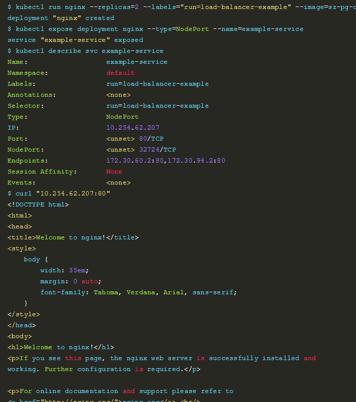
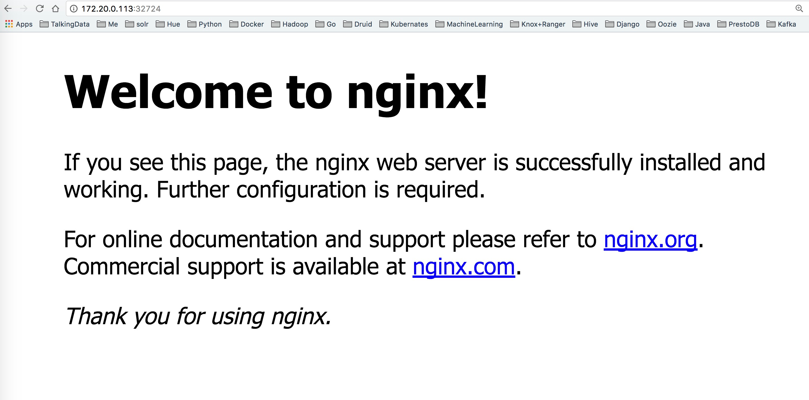

## 附录-验证kube-proxy


我们创建一个niginx的service试一下集群是否可用

```
kubectl run nginx --replicas=3 --labels="run=load-balancer-example" --image=daocloud.io/library/nginx:latest  --port=80


kubectl expose deployment nginx --type=NodePort --name=example-service


kubectl describe svc example-service
```


效果如下：



然后访问172.20.0.113:32724或172.20.0.114:32724或者172.20.0.115:32724都可以得到nginx的页面





- 如果一切正常却访问不到页面或者只有某个IP可以访问到，那么不妨重启下整个集群。
